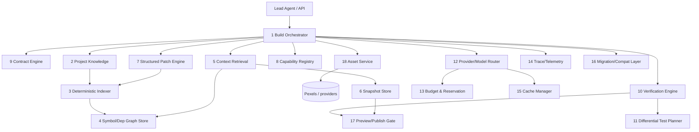

# BUILDER V2 — MASTER EXECUTION PLAN

Status: approved 2026-08-05 with owner corrections C1-C8 (applied throughout; listed in
§CORRECTIONS). Managed settlement is PAUSED until Phase 12 exit. Builder v1 remains
untouched; all v2 work is additive and feature-flagged. Every cost figure is labelled
target / projected / measured — no projection is ever presented as measured.

## Context

Builder v1's economics are structurally broken: six instrumented Codex production runs show
first builds at 24.26 → 46.10 → 32.65 credits against a 25-credit policy, all ending
`blocked`, while the original one-shot builder cost ~£0.16 by simply not verifying
anything. Every fix this week (modular scaffold, per-turn ceiling, semantic verifier,
scaffold visitorSession, classification execution-tests) narrowed failure classes, but the
architecture still regenerates the world per build, rediscovers its own tree, and verifies
everything every time. Builder v2 replaces the orchestration core — persistent knowledge,
deterministic indexing, immutable snapshots, structured patches, headless capabilities,
asset intelligence, first-green delivery, differential verification — while KEEPING the
proven gate/guard/billing machinery. On approval this plan is committed verbatim as
`docs/BUILDER-V2-MASTER-PLAN.md` and the safe foundations are implemented tonight
(zero model credits, managed settlement stays paused, no paid fixtures, Builder v1
untouched, no irreversible migrations without rollback).

## Execution steps on approval (tonight)

1. Write the full document below to `docs/BUILDER-V2-MASTER-PLAN.md` via the Write tool
   (a heredoc already failed on Windows command-length limits).
2. Implement Part 17 foundations in priority order, each with tests, small commits:
   - `supabase/migrations/<ts>_builder_v2_foundation.sql` (Part 3 SQL incl. asset tables,
     additive, reverse-drop rollback header) + extend `ops/backup-thrallo.mjs`
     CA_TABLES/RESTORE_ORDER + drift-guard test; apply via Supabase MCP only after the
     guard test is green locally.
   - `shell/server/lib/builderV2/featureFlags.mjs` (DB flags + env kill THRALLO_BV2_KILL).
   - `builderV2/knowledgeTypes.mjs` + `knowledge.mjs` skeleton.
   - `builderV2/indexer.mjs` (deterministic symbols/imports/refs/routes/entities, opaque
     fallback, diffIndex) — reuses the proven block parser + resolveInTree.
   - `builderV2/graphStore.mjs` (memory + supabase twins).
   - `builderV2/snapshotStore.mjs` (content-addressed, labels, diff, gc, storage seam).
   - `builderV2/retrieval.mjs` (Part 7 ranking, hard budget, traces, memo).
   - trace columns (ai_requests/diag_steps trace_id/parent_id/step) in the migration.
   - `ops/bv2-replay.mjs` — index/graph/retrieve/snapshot BOTH stored production trees
     (fixtures cf130c23 + run178f7fc8 + live tree 5c658a89): determinism + stats proof.
   - `builderV2/migrationState.mjs` (adopt/state machine scaffolding; no cutover).
   - If budget remains: `builderV2/assetService.mjs` provider seam + cache schema wiring
     (Pexels adapter reusing the existing searchImages client; no model involvement).
3. Full suite green (currently 1,056 + new tests); commit; deploy (archive→scp→web build→
   restart→smoke 31/31) — additive modules, zero behaviour change; CI green; pause flag
   re-verified post-deploy.
4. Final report: planned / implemented / deployed / not started / effort / critical path /
   next exact Codex prompt.

Verification: module tests against the real stored trees; `ops/bv2-replay.mjs`
deterministic output; migration applied + select-smoke + backup drift-guard green; prod
smoke 31/31; THRALLO_MANAGED_SETTLEMENT_PAUSED=1 confirmed after restart.

---

# MASTER PLAN CONTENT (verbatim for docs/BUILDER-V2-MASTER-PLAN.md)

Evidence base (all runs Codex lane, gpt-5.5, real production):

| run | date | pipeline | credits | outcome |
|---|---|---|---|---|
| FocusFlow (P19 first light) | 07-30 | one-shot | ~0.7 (≈£0.16 metered) | "worked", frontend-only, fake persistence undetected |
| baa3e8fc + f00c7950 | 08-02 | v1 pre-redesign | 21.37 | failed, customer blocked |
| 83883309 | 08-04 | v1 + staged | 19.25 real / 51.33 billed | billing defect found |
| cf130c23 / 94ad0b0f | 08-05 | v1 + PR1-7 | 24.26 | blocked at verification |
| 178f7fc8 / 30782000 | 08-05 | v1 + acceptance-fed stages | 46.10 | blocked; 3 repair loops |
| 17b6513f / 689e49e1 | 08-05 | v1 + modular scaffold | 32.65 | blocked; honesty CLEAN (first ever) |

## PART 1 — FORENSIC BASELINE

### 1.1 The £0.16 builder (2026-07-30, P19)
One `runAgent` loop, whole project in one call: BUILD_SYSTEM_PROMPT + request → write_file
per file → npm build → done. FocusFlow: 27 files, ~48k in / 6.7k out, 1 model call, ~8
turns, no contract, no verification beyond compile, no repair, no persistence checks,
latency ~90s. Cheap because it did almost nothing: apps were frontend-only, persistence
was localStorage, nothing checked. It FELT successful because nothing measured success.

### 1.2 Builder v1 today (post PR1-7 + this week)
Staged 4-phase generation; implementation contract; import preflight; per-stage gates
(imports/config/modularity/compile/honesty/expectations); deterministic persistence
transform; journey verifier (semantic transitions); verification agent; selective stage
context (targets+priors+interfaces+slices, 40k budget); stale-read compaction; byte-stable
stage prefix; per-turn credit guard on every lane; modular scaffold (routing-shell
App.jsx, visitorSession, complete SDK surface); reservation-backed dispatch; canonical
`creditsForUsage` billing; full diagnostics (diag_runs/diag_steps/ai_requests + provider
request ids); Pexels `search_images` tool driven BY the model (v1's asset weakness).

### 1.3 Version profiles

| | one-shot (P19) | staged v1 (cf130c23) | acceptance v1 (178f7fc8) | modular v1 (17b6513f) |
|---|---|---|---|---|
| model calls | 1 | 6 | 9 | 7 |
| turns | ~8 | 26 | 29 | 28 |
| in/cached/out tok | 48k/0/7k | 456k/287k/34k | 760k/387k/56k | 563k/305k/38k |
| context | whole prompt | selective 40k/stage | + prior files | + interfaces/slices |
| tools | write_file | scoped read/patch | same | same + free reads |
| scaffold | stub App.jsx | stub | stub | routing shell + visitorSession |
| structure | model's choice | 1×40KB App.jsx | 1×40KB App.jsx | 19 modules, shell 540 tok |
| verification | compile | full gates+journeys | same | same |
| repair | none | det-first + model | 3 in-stage loops | 1 icon fix |
| persistence | localStorage | localStorage generated | localStorage generated | CLEAN (scaffold session) |
| latency | ~1.5 min | 12.4 min | 17.6 min | 13.7 min |
| credits | ~0.7 | 24.26 | 46.10 | 32.65 |
| quality | looks-right-only | primary verified; 5 journeys fail | same class | 6/7 primary steps + 2 journeys pass |

### 1.4 Exact causes of cost growth (measured)
1. Append-only tool history × store:false — supporting stage once hit 292,652 in / 7,920
   out (37:1); every turn re-sends everything.
2. Discovery turns — 7 turns / 23–77k tok re-reading files the planner knew (fixed for
   priors; SDK internals until the surface doc).
3. Monolithic App.jsx — one 34KB write_file (10,269 out) to change one page; every stage
   re-carried it.
4. Repair loops on unverifiable shapes — 3 stages × hand-written visitorSession ≈ 13.4 cr.
5. Cache-hostile prompts — stage openings cached=0 until the shared prefix; zero
   cross-BUILD caching exists at all.
6. Rebuild-from-scratch economics — nothing persists between builds except the tree;
   an edit re-derives everything, images re-search every rebuild.
7. Guard gaps — silent classification bug let builds run to 46.10/32.65 past the 25
   ceiling (fixed, execution-tested).

### 1.5 Exact causes of first-build failure (measured)
Fake persistence generated (fixed at root: scaffold session + prompt + scan + transform);
expectations unknown to builder (fixed: transitions); journeys owned by no stage (fixed:
coverage check); verifier literalism/freshness vs default-selection (fixed: semantic
transitions); REMAINING REAL: missing secondary behaviours (cancel feedback, newsletter
messaging) — v1 generates them from prose and hopes; v2 makes them CAPABILITIES with tests.

### 1.6 Keep / Replace / Remove

| subsystem | verdict | reason |
|---|---|---|
| implementation contract (contractAgent) | KEEP, extend | proven; v2 adds capability bindings + essential/secondary tiers |
| honesty scan | KEEP | caught real fraud repeatedly; no false positives post-calibration |
| journey verifier (recalibrated) | KEEP | semantic transitions live-proven; Verification Engine browser layer |
| import preflight | KEEP | ms-cheap, real catches |
| modularity gate | KEEP | live-proven; becomes indexer-backed invariant |
| modular scaffold + visitorSession + SDK surface | KEEP | killed the fake-persistence class in one run |
| provider policy / lane classification | KEEP | execution-tested; Router builds on it |
| reservations + per-turn guard + byokJobCeiling | KEEP | execution-tested stop at 25.12 |
| diagnostics (diag_runs/steps/ai_requests) | KEEP, extend | canonical events; v2 adds trace hierarchy |
| design-profile system (family/typography/palette) | KEEP | proven visual variety lever; feeds Part 18 |
| Pexels client (searchImages) | KEEP as adapter | becomes one provider behind the Asset Service |
| model-driven search_images tool | REPLACE | → intent-based Asset Service; model never searches |
| checkpoints (build_checkpoints) | REPLACE | mutable rows → immutable content-addressed snapshots |
| staged 4-phase pipeline (stagedBuild/stagePlan) | REPLACE | fixed stages ≠ dependency order; v2 = first-green increments |
| stage-context heuristics (contextBuilder) | REPLACE | path/keyword heuristics → index + graph retrieval |
| whole-file write_file as primary mutation | REPLACE | → structured symbol patches; write_file only for NEW files |
| per-build ephemeral knowledge | REPLACE | → persistent Project Knowledge |
| engine contextSelection/cacheFriendly modes | REMOVE | superseded experiments, dead flags |
| contract-less single-turn build path | REMOVE at retirement | kept behind v1 until then |
| repairFakePersistence (old rewriter) | REMOVE | superseded by persistenceTransform |

## PART 2 — TARGET ARCHITECTURE

All services are MODULES in the existing shell process (`shell/server/lib/builderV2/`) —
same operational model as v1 (systemd thrallo-shell, Supabase, provisiond previews).
Service = module with frozen API, own tables, own tests; cross-boundary access only via
the listed APIs; `owner` is the first argument everywhere; every query owner-scoped.



**1 Build Orchestrator** (`orchestrator.mjs`) — R: run one build/edit/repair as a
first-green increment loop; owns end-states. In {owner, projectId, request, profile,
budget} → BuildResult{snapshotId, state}. API: runBuild/runEdit/resumeBuild/cancelBuild.
Storage bv2_builds. Failure: idempotent per step; crash → resume from last green snapshot.
Retry: none itself (steps own retries). Obs: emits trace root; all transitions recorded.

**2 Project Knowledge** (`knowledge.mjs`) — R: persistent per-project facts surviving
builds (entities, routes, capability bindings, design profile, decisions, contract
history, asset-style preferences). API: getKnowledge, recordFact, bindCapability,
knowledgeBrief() (≤1.5k tok, byte-stable render). Storage bv2_project_knowledge. Failure:
read-miss → empty knowledge, never blocks.

**3 Deterministic Indexer** (`indexer.mjs`) — R: parse revisions into symbols/imports/
routes/entities/refs; incremental by content hash. API: indexTree, indexFile, diffIndex.
Pure (Graph Store persists). Failure: parser-defeating file → `opaque:true` + hash only —
retrieval treats it whole-file, NEVER guesses. Zero deps: the proven regex+brace block
parser (production-validated in slicer/modularity).

**4 Graph Store** (`graphStore.mjs`) — R: persist index + edges; graph queries. API:
putFileIndex, neighbors(symbolOrFile, depth, direction), owners(routeOrJourney),
callersOf, importersOf, staleCheck(treeHashes). Storage bv2_file_revisions/symbols/
symbol_refs/dependency_edges. Failure: hash mismatch → reindex mismatched files only
(full reindex ≤2s for 40 files); FK inconsistency → drop project graph, full reindex
(idempotent upserts).

**5 Context Retrieval** (`retrieval.mjs`) — R: MINIMAL context per step: bodies for the
write-set, interfaces for neighbours, summaries beyond; hard budget. API:
retrieve({owner, projectId, snapshotId, targets, failureRefs, journeyIds, budgetTokens})
→ {full, slices, interfaces, summaries, omitted, tokens, trace}. Ranking (deterministic):
(1) failureRefs bodies, (2) targets bodies, (3) direct deps of write-set (interface
unless will-edit), (4) distance-1 callers as interfaces, (5) bound-capability interfaces
of touched journeys, (6) rest summary/omitted. score = 100·failureRef + 50·target +
30·directDep + 20·callerD1 + 15·capabilityIface + 5·sharesJourney − log2(tokens);
ties → smaller file first; over-budget → demote by ascending score, never silent.
Storage bv2_retrieval_traces (every inclusion reason+score).

**6 Snapshot Store** (`snapshotStore.mjs`) — R: content-addressed green states: blob =
sha256(file); snapshot = manifest {path→hash} + meta + ASSET manifest ref; promotion
pointers, never mutation. API: createSnapshot, getSnapshot, materialize, diff(a,b),
promote(id, label ∈ green|preview|published), gc(retention). Storage bv2_snapshots/
snapshot_files/blobs (>64KB blobs in thrallo-artifacts bucket). Failure: missing blob =
corrupt → snapshot unusable, previous promoted snapshot serves; reconstructable from
projects.tree during dual-run.

**7 Structured Patch Engine** (`patchEngine.mjs`) — model-facing strict-schema tool
`emit_patches`: `{file, ops:[{op: replace_symbol|insert_after_symbol|
insert_before_symbol|delete_symbol|append, symbol?, content?}]} | {newFile, content} |
{deleteFile}`. API: applyPatches(snapshotTree, patches, index) → {tree, applied,
rejected[{reason}]}. Validation: symbol exists (index), content parses (block parser),
imports resolve (preflight), modularity holds. Rejected op → machine reason fed back;
2 rejections of the same op → whole-file regeneration of that file only. Never a silent
partial.

**8 Capability Registry** — Part 6. **9 Contract Engine** — v1 contractAgent extended:
essential[]/secondary[] tiers + capabilities[] bindings + image intents per section;
storage diag contract + bv2_contracts.

**10 Verification Engine** (`verification.mjs`) — one API over layered checks D0-D5
(Part 9); D3 failures MUST name the owning module or downgrade to warn.

**11 Differential Test Planner** (`diffPlanner.mjs`) — plan(diff, graph, contract) →
{journeys[], checks[], reused[{journey, cachedVerdict}]}. Cache bv2_verification_cache
keyed (journeyId, ownersHash); unchanged owner-module hashes reuse verdicts — recorded as
`reused`, never silent.

**12 Provider/Model Router** — v1 providerPolicy + modelRouting kept; adds per-STEP
routing table (Part 10) + profile tiers; codex/BYOK/managed lane rules unchanged
(execution-tested).

**13 Budget & Reservation** — v1 creditReservations + managedUsageGuard + byokJobCeiling
kept; adds estimate(profile, contract) pre-build quote + per-step sub-budgets; all spend
through creditsForUsage (one pricing fn).

**14 Trace/Telemetry** — Part 11; extends diag/ai_requests with trace_id/parent_id/step.

**15 Cache Manager** (`cacheManager.mjs`) — registered byte-stable prefix segments with
hash per call (exists); verification cache (11); retrieval memo per (snapshotId,
querySignature); asset-search memo (18).

**16 Migration/Compat** (`compat.mjs`) — adoptV1Project(owner, projectId): tree →
snapshot + index + knowledge + asset-manifest bootstrap (scrape existing image URLs);
exportToV1Tree(snapshotId): keeps preview/publish/export working via projects.tree
write-through during dual-run.

**17 Preview/Publish Gate** — v1 gate kept; consumes SNAPSHOT ids; preview_ready only
after Verification Engine green on ESSENTIAL scope; publishes promoted snapshots only.

**18 Asset Service** — Part 18 (full spec). R: intent → licensed, cached, optimised
imagery; the model NEVER searches. API: resolveIntents(owner, projectId, intents[]) →
AssetRef[]; regenerate(owner, projectId, selector, directive); searchAssets(owner,
projectId, query). Storage bv2_assets + bv2_asset_manifest. Failure: provider down →
cached assets serve; no cache → deterministic branded-gradient placeholders (build never
blocks on imagery). Retry: provider calls 2× with backoff; rate-limit aware (Pexels
quota incident is in the history).

## PART 3 — DATA MODEL

Postgres (zczgvcsokfafuyognvwx), RLS deny-all, service-role only, `owner uuid not null`
indexed on every row, prefix `bv2_`. Retention via retentionService pattern. Deletion:
project-delete cascade extended to bv2 rows + blob/asset GC. Backfill: none (v2 starts
empty; v1 projects adopt lazily via compat).

```sql
-- migration builder_v2_foundation (additive; rollback = drop in reverse order)
create table bv2_feature_flags (
  key text primary key, value jsonb not null default 'false',
  updated_at timestamptz not null default now(), updated_by text);

create table bv2_migration_state (
  owner uuid not null, project_id uuid not null,
  state text not null default 'v1',            -- v1|shadow|dual|v2|v2_only
  adopted_at timestamptz, last_shadow_at timestamptz,
  notes jsonb not null default '{}', primary key (owner, project_id));

create table bv2_project_knowledge (
  id uuid primary key default gen_random_uuid(), owner uuid not null,
  project_id uuid not null,
  kind text not null,   -- entity|route|decision|design|constraint|capability|contract_ref|asset_style
  key text not null, value jsonb not null, source_build uuid,
  created_at timestamptz not null default now(),
  updated_at timestamptz not null default now(),
  unique (owner, project_id, kind, key));
create index on bv2_project_knowledge (project_id, kind);

create table bv2_file_revisions (
  id uuid primary key default gen_random_uuid(), owner uuid not null,
  project_id uuid not null, path text not null,
  content_hash text not null, size_bytes int not null, tokens int not null,
  opaque boolean not null default false, indexed_at timestamptz not null default now(),
  unique (owner, project_id, path, content_hash));
create index on bv2_file_revisions (project_id, path);

create table bv2_symbols (
  id uuid primary key default gen_random_uuid(), owner uuid not null,
  project_id uuid not null,
  revision_id uuid not null references bv2_file_revisions(id) on delete cascade,
  path text not null, name text not null,
  kind text not null,        -- function|const|class|component|route|entity_module
  exported boolean not null default false, is_default boolean not null default false,
  start_offset int not null, end_offset int not null, block_hash text not null,
  meta jsonb not null default '{}');   -- {returnsJsx, routes:[], entities:[]}
create index on bv2_symbols (revision_id);
create index on bv2_symbols (project_id, name);

create table bv2_symbol_refs (
  id uuid primary key default gen_random_uuid(), owner uuid not null,
  project_id uuid not null,
  revision_id uuid not null references bv2_file_revisions(id) on delete cascade,
  from_symbol uuid not null references bv2_symbols(id) on delete cascade,
  ref_name text not null, resolved_path text, count int not null default 1);
create index on bv2_symbol_refs (project_id, ref_name);

create table bv2_dependency_edges (
  id uuid primary key default gen_random_uuid(), owner uuid not null,
  project_id uuid not null,
  revision_id uuid not null references bv2_file_revisions(id) on delete cascade,
  from_path text not null, to_path text, specifier text not null);
create index on bv2_dependency_edges (project_id, from_path);
create index on bv2_dependency_edges (project_id, to_path);

create table bv2_snapshots (
  id uuid primary key default gen_random_uuid(), owner uuid not null,
  project_id uuid not null, build_id uuid,
  parent_snapshot uuid references bv2_snapshots(id),
  tree_hash text not null, label text,   -- null|green|preview|published
  reason text not null,   -- initial|increment:<id>|repair|promotion|adopt
  file_count int not null, total_tokens int not null,
  asset_manifest jsonb not null default '[]',   -- [{assetId, page, section, slot}]
  -- C2 ATOMICITY: a snapshot is INERT until state='ready'. Creation: persist/verify every
  -- blob -> insert snapshot(state='building') -> insert complete manifest -> recompute and
  -- validate tree_hash from the manifest -> state='ready'. Only 'ready' snapshots are
  -- promotable; interrupted creations leave 'building' rows that GC sweeps and nothing can
  -- use. A missing blob aborts creation. Later corruption detection sets state='corrupt'.
  state text not null default 'building',        -- building|ready|corrupt
  created_at timestamptz not null default now());
create index on bv2_snapshots (project_id, created_at);
create unique index on bv2_snapshots (project_id, tree_hash);

-- C2: promotion is ONE atomic pointer write per label; rollback is one pointer write back.
create table bv2_project_pointers (
  owner uuid not null, project_id uuid not null,
  label text not null,                           -- green|preview|published
  snapshot_id uuid not null references bv2_snapshots(id),
  updated_at timestamptz not null default now(),
  primary key (owner, project_id, label));

create table bv2_snapshot_files (
  snapshot_id uuid not null references bv2_snapshots(id) on delete cascade,
  path text not null, content_hash text not null,
  primary key (snapshot_id, path));

create table bv2_blobs (
  owner uuid not null,
  content_hash text not null,
  content text,            -- inline ≤64KB
  storage_path text,       -- thrallo-artifacts object beyond
  size_bytes int not null, created_at timestamptz not null default now(),
  -- C1 TENANT ISOLATION: dedup is PER OWNER, never global — a global content-addressed
  -- store would let one tenant probe another's source by hash and entangle GC across
  -- tenants. Two owners storing identical content hold independent rows; resolution,
  -- deletion and GC are always owner-scoped; snapshot materialisation checks owner.
  primary key (owner, content_hash));

create table bv2_contracts (
  id uuid primary key default gen_random_uuid(), owner uuid not null,
  project_id uuid not null, build_id uuid, version int not null,
  contract jsonb not null,   -- incl. essential/secondary tiers + image intents
  capabilities jsonb not null default '[]',
  created_at timestamptz not null default now());

create table bv2_retrieval_traces (
  id uuid primary key default gen_random_uuid(), owner uuid not null,
  build_id uuid not null, step text not null, snapshot_id uuid,
  query jsonb not null,
  included jsonb not null,   -- [{path, form, reason, score, tokens}]
  omitted_count int not null, tokens int not null,
  created_at timestamptz not null default now());

create table bv2_patches (
  id uuid primary key default gen_random_uuid(), owner uuid not null,
  build_id uuid not null, step text not null,
  model_call_id uuid,        -- ai_requests.id
  patch jsonb not null, outcome text not null,   -- applied|rejected|escalated
  reject_reason text, files_changed jsonb not null default '[]',
  created_at timestamptz not null default now());

create table bv2_verification_cache (
  owner uuid not null, project_id uuid not null, journey_id text not null,
  owners_hash text not null,   -- hash over owning modules' block hashes
  verdict jsonb not null, snapshot_id uuid not null,
  created_at timestamptz not null default now(),
  primary key (owner, project_id, journey_id, owners_hash));

create table bv2_builds (
  id uuid primary key default gen_random_uuid(), owner uuid not null,
  project_id uuid not null, profile text not null, request text not null,
  state text not null default 'created',
  -- created|contracting|indexing|assets|core|verify_core|increment:<n>|repair|green|blocked|failed|cancelled
  budget_credits numeric, spent_credits numeric not null default 0,
  contract_id uuid, final_snapshot uuid, error text,
  started_at timestamptz not null default now(), finished_at timestamptz);
create index on bv2_builds (owner, project_id, started_at);

-- PART 18 asset intelligence
create table bv2_assets (
  id uuid primary key default gen_random_uuid(), owner uuid not null,
  project_id uuid not null,
  provider text not null,            -- pexels|unsplash|pixabay|upload|library
  provider_asset_id text not null,
  original_url text not null, optimised_url text, thumbnail_url text,
  storage_path text,                 -- our optimised copy in thrallo-artifacts
  search_query text, intent text, category text,
  tags jsonb not null default '[]',
  page text, section text, slot text,
  alt_text text not null default '',
  width int, height int, orientation text,   -- landscape|portrait|square
  license jsonb not null default '{}',       -- {name, attributionRequired, attributionHtml}
  content_hash text,                 -- of the optimised bytes; duplicate detection
  variants jsonb not null default '{}',      -- {avif:[...], webp:[...], sizes:[...], blur}
  usage_count int not null default 0, last_used timestamptz,
  created_at timestamptz not null default now(),
  unique (owner, project_id, provider, provider_asset_id, slot));
create index on bv2_assets (project_id, intent);
create index on bv2_assets (project_id, content_hash);

alter table ai_requests add column if not exists trace_id uuid,
  add column if not exists parent_id uuid, add column if not exists step text;
alter table diag_steps add column if not exists trace_id uuid,
  add column if not exists parent_id uuid;
```

Tenant-isolation review (C1): every unique key and FK above is either owner-prefixed or
reached only through an owner-scoped parent (bv2_snapshots unique (project_id, tree_hash)
is safe because a project id belongs to exactly one owner and every query filters owner;
symbols/refs/edges hang off owner-scoped revisions). bv2_blobs is the one table where
global dedup was tempting and is deliberately per-owner.

Budget reservations stay in-memory per lifecycle (deliberate, incident-tested); spend
derived from diag totals. Retention: retrieval_traces/patches 90d; verification_cache
invalidated by owners_hash + 30d sweep; snapshots keep all labelled + last 20/project;
blobs/assets GC when unreferenced by any retained snapshot manifest.

## PART 4 — PIPELINE PROFILES

Classification deterministic from the contract (entities/journeys/integration flags),
overridable per request; a build may never silently upgrade its own profile (escalation =
end-state `needs_approval`).

| | SIMPLE | MEDIUM | ADVANCED |
|---|---|---|---|
| examples | landing, contact, portfolio, booking-lite, small CRUD | SaaS dashboard, ecommerce, admin, multi-entity | Roblox tools, IDEs, visual editors, CAD/media |
| contract depth | lite: ≤3 journeys, ≤2 entities, essential-only tiering | full journeys+states+ops+acceptance | full + module plan + user-approved plan |
| model calls | 2–4 | 5–9 | pre-estimated, approved |
| max turns/call | 6 | 8 | 10 |
| context/step | ≤12k tok | ≤20k | ≤32k |
| capabilities | mandatory (no bespoke persistence/auth) | mandatory + custom entities | capabilities + bespoke modules |
| assets | intents resolved pre-core; 0 model image turns | same + per-section intents | same + user libraries |
| snapshots | after core + each increment | same | + each module |
| verification | D0-D3 essential; D4 sampled | D0-D4 full | D0-D5 + custom harness |
| repair tiers | det → 1 targeted | det → 2 targeted → 1 regen | det → 2 targeted → regen w/ approval |
| cost target | first green ≤2 cr (booking-lite ≤6); edit ≤0.5 | ≤5–8 core; edit ≤1 | quoted; ceiling = quote×1.25 |
| latency | core green ≤3 min | ≤8 min | quoted |
| stop | ceiling floor; 2 failed repairs of one defect; essential journey unbuildable | same | same + plan drift |
| escalation | needs_approval w/ measured evidence | same | same |

Flows — SIMPLE: contract-lite (1 call, emits image intents) → adopt/index → Asset Service
resolves intents (0 model) → CORE increment (1 call: capability wiring + primary journey
via patches; AssetRefs injected as constants) → D0-D2 → D3 essential → green snapshot +
preview → secondary increments (1 call each, differential verify). MEDIUM adds design
pass, per-entity data increments, D4. ADVANCED adds module-plan call, approval gate,
per-module increments, D5 harness.

## PART 5 — FIRST-GREEN DELIVERY

Algorithm (replaces fixed stages):
1. Contract tiers requirements: essential = the ONE primary journey + entities it touches
   + operations it invokes + its states; secondary = the rest unless user-marked critical.
2. Dependency DAG: capability bindings → data modules → primary route/components → shell
   wiring; topological order = build order. Assets resolve before core (non-blocking:
   placeholders on provider failure).
3. CORE increment: one model call emits patches for the whole essential set (profile
   context bound) → D0-D2 → browser-verify ESSENTIAL journeys only (D3e).
4. Green → snapshot(label=green) → preview_ready (preview shown at first green of the
   essential scope, never before; secondary gaps visibly labelled in the conversation).
5. SECONDARY increments: one per contract group: patches → D0-D2 → differential D3 (only
   journeys whose owners changed) → snapshot. A failed increment rolls back to the
   previous snapshot and reports; the green core is never blocked by it.
6. Increments start from the CURRENT snapshot's index — no rediscovery.
7. Communication: conversation lists shipped vs pending increments explicitly.

FIRST-GREEN AS A PLATFORM INVARIANT (C4): the essential/secondary split is PERSISTED
(bv2_contracts tiers + bv2_builds state), never recomputed ad hoc. Preview eligibility is
exactly: all ESSENTIAL D0-D3 checks pass AND no essential backend-row failure AND no
essential blocking console/network error. A secondary failure never blocks the core
preview unless the user explicitly marked it essential; it stays visible as pending work,
continues from the green snapshot, and can never regress the delivered core (increments
always branch from the current green pointer; a failed increment can never become a
pointer). Regression fixtures encode the measured booking evidence (run 689e49e1): core
booking works, newsletter fails, cancellation fails -> the core preview SHIPS with exactly
those two increments listed as pending.

Booking explicit sequence: (CORE) 1 booking.create via capability + visitor session ·
2 conflict/capacity guard · 3 confirmation state w/ reference · 4 refresh persistence
(D3e gate) — then increments: 5 owner list · 6 cancellation (status transition UI) ·
7 newsletter (feedback states) · 8 advanced navigation · 9 polish.

## PART 6 — HEADLESS CAPABILITY SYSTEM

Capability = versioned, tested, headless module in the scaffold under
`src/lib/capabilities/<name>/` + registry entry the Contract Engine binds and the builder
IMPORTS — never rewrites. Registry entry: {name, version, interface, package, migrations
(entity types owned), tests (platform proof), upgradePolicy: replace-on-iterate|pinned,
compat: semver, visualIndependence: headless-only}.

| capability | v1 interface (headless) |
|---|---|
| auth/session | ensureSession, currentUser, signOut |
| guest session | ensureVisitorSession (exists, proven) |
| crud | makeEntityStore(type) → list/get/create/update/remove/subscribe |
| booking | createBooking, getBooking(ref,email), listBookings, cancelBooking |
| availability | slotsFor(date), remaining(slot), holdsCapacity(slot,size) |
| conflict prevention | guardCapacity(create) — atomic re-check refusal |
| cancellation | cancelBooking → status transition + capacity release |
| contact form | submitContact(fields) + validation map |
| newsletter | subscribe(email) → {ok|duplicate|invalid} + REQUIRED UI states |
| file uploads | upload(file) → {path,url} |
| payments | checkout(items) — interface reserved, DORMANT until Stripe decision |
| notifications | notifyOwner(event) (web push exists platform-side) |
| analytics hooks | track(event, props) (no-op default, privacy-gated) |
| search/filter/pagination | query(type, {filters, sort, page}) over crud |
| role/ownership | requireOwner(row), isOwner(row) |

Each ships: implementation, platform test file (memory backend + one live schema proof),
version constant, UI CONTRACT (states the UI must render — e.g. newsletter idle/invalid/
success/duplicate; enforced by the D1 capability-contract lint). Upgrades: scaffold
refresh on iterate when the project's pinned major matches (pin in knowledge). Visual
uniqueness: capabilities export functions and state enums only — no JSX/classes/styles;
Part 18's visual system owns all appearance. Modularity gate + protected paths extend to
`src/lib/capabilities/`.

## PART 7 — KNOWLEDGE AND INDEXING

INDEXER V0 (C3 — foundations, stored replay and shadow indexing ONLY): the zero-dependency
block parser (regex + brace matching, production-proven in the slicer and modularity gate)
extended per symbol: imports (resolveInTree), exports, JSX detection, route literals,
db.entity("X")/capability calls, and call references (identifier scan of block bodies
against the project symbol table). opaque:true is the honest fallback. Regex/brace parsing
is NOT sufficient for final production code intelligence and is not claimed to be.

INDEXER V1 (required before broad rollout — Phase 14 entry criterion): a real syntax
parser behind the SAME FileIndex interface, so v0->v1 is a swap, not a redesign.

| candidate | runtime cost | dependency cost | incremental | symbol precision | failure behaviour |
|---|---|---|---|---|---|
| @babel/parser | pure JS, ~2-6ms/file at our sizes | one JS dep, no native/wasm | per-file (fits the content-hash model) | full JS/JSX/TS/TSX via plugins, exact spans | errorRecovery:true yields partial AST -> degrade to opaque, never crash |
| Tree-sitter (web-tree-sitter) | wasm init, very fast parses | wasm grammar per language, packaging weight | true intra-file incremental (unneeded: hashing gates reparse) | excellent | error nodes, robust |
| TypeScript compiler API | heaviest, slow cold start | very large | LanguageService, complex | best TS SEMANTICS incl. types | rarely throws, overkill |

DECISION: @babel/parser for Indexer v1 — pure JS (no native/wasm packaging risk on the
VPS), exact spans, full JSX/TSX, per-file parsing matches the content-hash incremental
model exactly, and errorRecovery composes with the permanent opaque fallback. Tree-sitter
is the fallback if measured parse cost ever matters; the TS compiler is rejected for
generated-app-sized trees. The opaque-file fallback is PERMANENT across v0 and v1. Incremental: keyed by content_hash; unchanged files never reparsed; diffIndex
feeds the differential planner. Invalidation: tree-hash mismatch → reindex changed paths
only. Stale recovery: staleCheck vs snapshot manifest → sync reindex (≤2s/40 files).
Corrupt recovery: parser throw or FK inconsistency → drop project graph, full reindex
(idempotent). Embeddings: PERMITTED only for advanced-profile cross-file semantic search +
repo import (existing encrypted repositoryIndexer) and the asset index's tag search;
PROHIBITED for simple/medium code retrieval, and always over `.env`/secrets/platform lib
code. Retrieval ranking: Part 2 §5 formula.

## PART 8 — SNAPSHOTS AND PATCHING

Green creation: only the Verification Engine labels green (D0-D2 + the increment's
differential D3 scope). Immutable: snapshots/blobs insert-only; promotion = pointer row;
GC only via retention. Hashing: per-file sha256; tree_hash over sorted pairs (identity
for dedup/cache/drift). Diff: manifest compare + symbol diff via diffIndex. Targeted
repair context: verifier-named failureRefs ranked first; repair budget = profile tier.
Patch format/validation/escalation: Part 2 §7 (strict-schema emit_patches — strict tools
proven since P18). Rollback: failed increment → materialize previous snapshot; promotion
rollback = pointer moves back atomically. Module regeneration: replaces exactly one file
with dependents' interfaces in context. Promotion: green → preview (gate) → published.
Asset manifest versions WITH the snapshot (Part 18): restoring a snapshot restores its
imagery exactly.

## PART 9 — VERIFICATION

D0 static: preflight, build-config, modularity, protected paths, patch validation.
D1 honesty scan + capability-contract lint (bound capability's required UI states
present) + asset lint (no hotlinked non-provider URLs, alt text present).
D2 compile (vite). D3 browser journeys (semantic-transition verifier): D3e essential
(gates preview), D3f full. D4 environment: console/network clean, mobile drive,
accessibility (axe-core headless), backend ROW verification (entity rows really exist
post-journey — probe exists). D5 advanced: contract-generated custom harness.
Differential: journeys re-run only when owning-module block hashes changed; cache hits
recorded as `reused` with original evidence id. False-positive controls: semantic
transitions, qualitative-adjective filter, URL-change navigation, form-state probe,
undriveable≠fail (all proven) + D3 failure must name owning module or downgrade to warn.
Ownership: Verification Engine owns verdicts; the orchestrator cannot overrule.
preview_ready blocks on EXACTLY: D0 ∧ D1 ∧ D2 green ∧ D3e pass ∧ zero failed backend-row
checks ∧ zero blocking console/network errors. Secondary failures annotate, never block.

## PART 10 — COST ARCHITECTURE

Prefixes: one registered segment order (system, SDK surface, capability interfaces,
contract, invariants) byte-stable per build, hash-logged (exists), reused across
increments; per-PROJECT stable segments (knowledge brief) precede per-build ones.
Caches: global (scaffold/SDK docs), project (knowledge, index, snapshots, verification
cache, ASSETS), build (retrieval memo, prefix). Dedup: retrieval memo returns
byte-identical blocks for identical queries; asset intents memoised per project. Tool
history: stale-read compaction (proven) + patch-first small outputs. Deterministic first:
every deterministic gate/repair/asset resolution before ANY model call. Routing table
(initial; tuned in P17 from traces): contract-lite→fast · design→balanced · core
increment/module gen→strong · secondary increments→balanced · targeted single-file
repair→fast, balanced on retry · repair brief→balanced. Provider caching: byte-stable
prefixes only; NO prompt_cache_key on codex (measured harm). Measurement: canonical
creditsForUsage path unchanged. Ceilings: profile budget → byokJobCeiling/allowance →
per-turn guard with pre-emptive floor (proven). Reservations: managed pre-call holds
(proven). Estimates: estimate() from profile+contract; always shown for ADVANCED and any
build projected over target.

Economics (C5 — labels are binding: Part 1 v1 numbers are MEASURED; every figure in this
table is TARGET (the goals) or PROJECTED (the ranges); nothing here is measured. Customer
estimates ship only once derived from real v2 trace history by profile and contract
complexity. Image handling costs zero model tokens by construction):

| scenario | calls | tokens in/out | credits |
|---|---|---|---|
| simple first build (landing/contact) | 2–3 projected | 25–45k / 6–10k projected | 0.9–1.8 projected vs ≤2 target |
| simple edit | 1 projected | 6–12k / 1–3k projected | 0.15–0.4 projected vs ≤0.5 target |
| booking-lite first green CORE | 3–4 projected | 60–90k / 10–14k projected | 3–5 projected core, 5–8 projected full; ≤6 core target (≤2 is NOT realistic for a VERIFIED booking flow) |
| medium first build core | 5–7 projected | 120–200k / 18–30k projected | 4.5–8 projected; ≤5 target for lighter mediums |
| medium edit | 1–2 projected | 15–30k / 3–6k projected | 0.4–1 projected vs ≤1 target |
| advanced | quoted | quoted | quote ±25%, approval-gated |

## PART 11 — OBSERVABILITY

One hierarchy: trace_id = build id; parent_id chains account→project→build→step→model
call→tool call→patch→verification→outcome. Storage = EXISTING canonical tables extended
(ai_requests/diag_steps gain trace/parent/step; bv2_patches/bv2_retrieval_traces link by
build_id) — no second source of truth. Records carry tokens/cached/cost/provider ids/
latency (exist) + context trace id, prefix hash, snapshot ids, verifier verdict refs,
customer-visible state per transition. Surfaced in DiagnosticsView v2 tab + ops
telemetry. Langfuse: adopt LATER as a self-hosted EXPORTER fed from canonical events
(visualisation only, never system of record). LiteLLM: REJECTED as proxy — conflicts with
the codex transport, provider policy and canonical billing; adds a failure hop for no
routing value. Decision recorded to prevent relitigation.

## PART 12 — SECURITY AND PRIVACY

Owner-scoped RLS deny-all on all bv2 tables (v1 pattern); retrieval NEVER includes
`.env*`; indexer skips secret-shaped files; traces store paths+hashes, content only in
owner-scoped blobs; blobs/assets inherit bucket encryption; store:false everywhere
(exists); provider ids retained for audit; project deletion cascades bv2 rows + blob and
asset GC (wired into the PR-71 cascade); account deletion inherits; export = materialized
snapshot incl. optimised assets + licence/attribution file; patches/promotions/flag flips
carry updated_by + timestamps; capabilities are IN-REPO, reviewed, versioned — no runtime
fetch; scaffold deps pinned; capability "signing" = version constant + platform suite
green enforced by CI before a scaffold ships. Asset licences stored per asset; Pexels
requires no attribution but the field is mandatory for future providers. Embeddings
privacy per Part 7.

## PART 13 + 14 — ROADMAP WITH EVERY PR

Conventions: every PR lands green (suite currently 1,056 + its new tests), deploys via
archive→scp→build→restart→smoke 31/31, carries its rollback note, is proof-gated. NO paid
fixture without explicit user approval; spend points marked **SPEND**.

**Phase 0 — freeze/baseline.** V2-00: this doc + fixtures (already committed). Exit: merged.

**Phase 1 — schemas/flags.**
- V2-01 migration bv2 foundation (Part 3 SQL incl. bv2_assets; ops/backup CA_TABLES +
  RESTORE_ORDER extended; drift-guard test updated). Proof: applied additively to prod,
  select-smoke every table, backup lists them. Rollback: reverse-drop header. Outcome:
  storage exists, zero runtime change.
- V2-02 featureFlags.mjs (DB flags, 60s cache, env kill THRALLO_BV2_KILL beats DB).
  Tests: precedence/cache/unknown=false. Proof: prod flip visible ≤60s. Rollback: truncate.

**Phase 2 — indexing/knowledge.**
- V2-03 indexer.mjs. Tests vs BOTH stored production trees (94ad0b0f monolith, 5c658a89
  modular): symbol counts, span reparse-stability, hash idempotence, opaque path. Proof:
  ops/bv2-replay.mjs indexes both, two runs byte-identical.
- V2-04 graphStore.mjs (memory+supabase twins; neighbors/callersOf/importersOf/
  staleCheck). Tests: twin parity; stale/corrupt reindex only mismatches. Proof: modular
  tree stored in prod under test owner; neighbors(BookingSlotSelector) → BookPage.
- V2-05 knowledge.mjs + knowledgeBrief (≤1.5k tok, byte-stable). Tests: upsert, brief
  stability, cascade. Proof: adopt one real project's entities/routes from its index.

**Phase 3 — snapshots/diffs.**
- V2-06 snapshotStore.mjs. Tests: immutability (re-put = same ids), diff on the two
  stored trees, corrupt-blob detection, gc respects labels. Proof: snapshot both prod
  trees; diff monolith→modular prints the 19-module split.
- V2-07 compat.mjs adopt/export (+ asset-manifest bootstrap from existing image URLs).
  Tests: tree→snapshot→tree byte round-trip. Proof: adopt 5c658a89 in prod under shadow
  flag; projects.tree untouched. Rollback: delete adopted rows, migration_state→v1.

**Phase 4 — retrieval.** V2-08 retrieval.mjs (ranking, forms, hard budget, traces, memo).
Tests: DateSelector failure case (selector+caller, NOT App/world), demotion order, trace
completeness, memo determinism. Proof: replay the 46-run data-stage query at ≤12k tokens
vs 23,993 observed.

**Phase 5 — patches/verification facade.**
- V2-09 patchEngine.mjs + emit_patches schema. Tests: every op on the real modular tree;
  unknown-symbol reject; non-parsing reject; modularity reject; escalation after 2;
  newFile path. Proof: apply a synthetic cancel-confirmation patch to the stored modular
  tree; D0-D2 pass locally.
- V2-10 verification.mjs facade (D0-D4 over existing gates; owning-module attribution).
  Tests: verdict parity with v1 gates on stored trees; attribution downgrade. Proof:
  replay-modular-verify rewired through the facade, identical verdicts.
- V2-11 diffPlanner.mjs + verification cache. Tests: unchanged owners→reused recorded;
  changed hash→re-run; invalidation. Proof: verify modular tree twice — second run drives
  0 journeys, reuses 5, and says so.

**Phase 6 — capabilities.**
- V2-12 capability kernel + registry + crud/guest-session/role (guest = move of proven
  visitorSession). Proof: scaffold compiles; capability suite green; protected paths
  extended.
- V2-13 booking domain (booking/availability/conflict/cancellation) + contact +
  newsletter with UI state contracts. Tests: atomic capacity race, cancel transition,
  newsletter states. Proof: headless proof against real entities schema (service-role,
  test app id) — zero model.
- V2-14 contract extension (tiers + bindings + image intents; bv2_contracts). Tests:
  booking tiers per Part 5; binding validation; intent emission. Proof:
  recorded-contract fixture through tiering — zero model.

**Phase 6A — asset intelligence (before any v2 spend).**
- V2-A1 assetService.mjs core: provider seam (Pexels adapter wrapping the existing
  searchImages client), intent → ranked selection (quality heuristics of Part 18), cache
  in bv2_assets, dedupe by content_hash, licence metadata, deterministic placeholder
  fallback. Tests: fake provider adapter (recorded Pexels payloads), cache-hit short-
  circuit (second resolve = 0 provider calls), dedupe, fallback. Proof: resolve the
  booking site's intents against RECORDED payloads offline; re-run → zero searches.
- V2-A2 optimisation + variants: sharp-based AVIF/WebP/responsive/blur placeholder
  generation into thrallo-artifacts, width/height metadata, lazy-load markup helper in
  scaffold (`src/lib/assets.js`). Tests: variant generation on fixture images; scaffold
  helper renders picture/srcset. Proof: optimised copies served from bucket in prod for
  one test project. (Adds `sharp` dependency to the SHELL only, never generated apps.)
- V2-A3 asset index + regeneration: searchAssets (tag/intent/provider filters + optional
  embedding search), regenerate(selector, directive) — selective re-resolution honouring
  "replace hero"/"darker photography" directives via provider query rewriting rules;
  manifest versioning with snapshots; user-upload provider. Tests: selective regeneration
  changes ONLY selected slots; snapshot restore restores imagery. Proof: replay on
  adopted 5c658a89 assets.

**Phase 7 — simple pipeline.**
- V2-15 orchestrator.mjs first-green loop (fake-provider seam; state machine incl.
  `assets` step; crash-resume; increment rollback; stop rules). Proof: deterministic e2e —
  fake patches + recorded assets → green landing page from scaffold, no model.
- V2-16 shadow entry `app_build_v2` behind flags (bv2.enabled + profiles + owners; kill
  switch). Proof: prod deploy, flag off, zero change (smoke 31/31).
- V2-17 **SPEND (approval required):** ONE real simple build (landing/contact, Codex,
  ceiling 5). Target ≤2 cr first-green, assets cached, zero image searches on the model
  path. Rollback: flag off. Exit: measured ≤2 or written variance analysis.

**Phase 8 — differential live.** V2-18 edit path (adopt→retrieve→patch→differential).
Tests: one-component edit re-drives exactly 1 journey; rebuild reuses every cached asset
(zero provider searches). Proof: zero-credit replay + ONE approved real edit ≤0.5 cr.
**SPEND (approval).**

**Phase 9 — medium pipeline.**
- V2-19 medium profile (design pass, per-entity increments, D4 full). Proof: zero-credit
  scripted medium; then ONE approved booking build ≤6 core/≤9 full — the definitive
  v1-vs-v2 comparison on the same stored prompt. **SPEND (approval).**
- V2-20 repair tiers v2 (targeted-via-retrieval, bounded 2, regen escalation). Proof:
  replay the cancel-feedback defect from 689e49e1 as a v2 targeted repair (fake provider,
  real gates).

**Phase 10 — advanced.** V2-21 advanced profile (module plan, quote+approval, D5 harness,
per-module increments). Proof: zero-credit scripted flow; live advanced deferred to
post-rollout (not launch-blocking).

**Phase 11 — observability/routing.**
- V2-22 trace hierarchy threaded through v2 + DiagnosticsView v2 tab. Tests: hierarchy
  integrity, no orphan spend. Proof: prod trace renders account→…→outcome for V2-19's
  build.
- V2-23 per-step routing + outcome learning (existing providerIntelligence) scoped by
  step-kind. Tests: routing respected; lane suites unchanged. Proof: telemetry shows
  per-step model mix.

**Phase 12 — shadow production.** V2-24 shadow-index every v1 build post-completion
(bv2.shadow). Tests: shadow failure NEVER affects v1 (fault injection). Proof: 1 week of
prod v1 builds shadow-indexed, drift dashboard clean. **Managed settlement may be
UNPAUSED here** after: billing reconciliation re-run on the week's rows; zero divergence
creditsForUsage↔debits; one controlled managed build proving the guard arms on managed.

**Phase 13 — dual-run.** V2-25 dual-run harness for allowlisted prompts, comparing
cost/turns/green-rate/journey pass-rate into archived reports. Proof: ≥5 pairs with v2 ≥
v1 green-rate at ≤50% cost. Rollback: flag.

**Phase 14 — limited rollout.** V2-26 new-project simple builds default v2 for
allowlisted owners; auto-rollback (2 consecutive non-budget failures → owner reverts to
v1 + incident; global: >20% failed over 6h → default off + incident). Proof: 1 week, ≥20
builds, green-rate ≥ v1, cost ≤ targets; one prod project-deletion drill; one rollback
drill.

**Phase 15 — broad rollout.** V2-27 v2 default for all NEW projects (simple+medium);
existing projects via opt-in banner. Proof: 2 weeks stable, support incidents ≤ v1.

**Phase 16 — v1 retirement.**
- V2-28 v1 edits adopt-then-v2; projects.tree becomes write-through view of promoted
  snapshot. Proof: 10 legacy projects edited via v2; exports byte-sane; previews fine.
- V2-29 v1 code removal (stagedBuild/stagePlan/contextBuilder heuristics/engine dead
  modes/model-driven search_images) behind git tag `builder-v1-final`; gates/verifier/
  guards REMAIN (they are v2's). Exit: 14 days zero v1-routed builds + dual-run report
  archived + tag pushed. Rollback: revert tag.

**Phase 17 — post-launch.** V2-30 cost tuning from traces · V2-31 verification-cache
cross-build promotion · V2-32 optional Langfuse exporter · V2-33 advanced live
validation · V2-34 additional asset providers (Unsplash/Pixabay/company libraries).

## PART 15 — MIGRATION AND CUTOVER

Flags: bv2.enabled, bv2.shadow, bv2.profiles[], bv2.owners[], bv2.dualrun,
bv2.default_new_projects, bv2.edits_on_v1 + env kill THRALLO_BV2_KILL (absolute, beats
DB, checked per turn). Eligibility: new projects first; existing only after V2-07 adopt
and V2-28. Shadow: Phase 12. Dual-run: Phase 13. Opt-in: Phase 15 banner; opt-out
returns to v1 until V2-29. Auto-rollback: V2-26 rules. Snapshot compatibility:
projects.tree write-through until retirement; v2 export = materialized snapshot
(identical artifact + assets + licence file). Cutover criteria: Phase 15 proof + billing
audit clean. Retirement criteria: V2-29 list.

## PART 16 — TEST AND PROOF MATRIX

| scenario | fake provider | stored replay | shadow | real model | live prod |
|---|---|---|---|---|---|
| landing page | V2-15 e2e | — | P12 | V2-17 (1) | rollout |
| contact form | V2-15 | — | P12 | w/ V2-17 | rollout |
| booking | V2-14/19 scripted | 5c658a89 replays | P12 | V2-19 (1) | rollout |
| CRUD | V2-12 suite | — | P12 | rollout traffic | rollout |
| SaaS / ecommerce | V2-19 scripted | — | P12 | 1 each in P14 | rollout |
| Roblox model creator | V2-21 scripted | — | — | V2-33 | later |
| asset cache/regeneration | V2-A1/A3 recorded payloads | adopted 5c658a89 assets | P12 | w/ V2-17 | rollout |
| broken imports | preflight suite (exists) | 17b6513f Wheelchair case | — | — | — |
| fake persistence | honesty+transform suites | 94ad0b0f tree | — | — | — |
| monolithic component | modularity suite | 178f7fc8 App.jsx | — | — | — |
| stale index | V2-04 tests | hash-tamper replay | P12 drift | — | — |
| corrupted snapshot | V2-06 tests | blob-delete replay | — | — | — |
| provider failure (model) | lane/policy suites (exist) | — | — | — | v1 history |
| provider failure (asset) | V2-A1 fault injection | — | — | — | — |
| budget exhaustion | guard replay (exists) | 32.65-turn replay (exists) | — | — | — |
| concurrent builds | reservation suite + V2-15 double-dispatch | — | — | — | rollout |
| rollback | V2-15 increment-rollback | snapshot pointer replay | — | — | P14 drill |
| project deletion | cascade tests (extend PR-71) | — | — | — | P14 drill |

## PART 18 — ASSET INTELLIGENCE SYSTEM

Objective: professional, visually unique applications with ZERO model tokens spent on
imagery and ZERO repeated searches. The model requests INTENTS; the Asset Service does
everything else. The builder never talks to Pexels — only to the Asset Service.

**Flow.** Contract emits per-section image intents ("family dentist reception", hero,
landscape). Orchestrator `assets` step → assetService.resolveIntents(): (1) manifest
lookup — every intent already bound to an asset in the project's manifest returns
instantly, NO search; (2) cache lookup by (project, intent) in bv2_assets; (3) provider
search (Pexels first) → deterministic ranking → selection → optimisation → cache; (4) on
provider failure → cached fallback → branded deterministic placeholder (build never
blocks). Selected AssetRefs are injected into generation context as CONSTANTS
(`src/lib/assets.js` data map) — the model consumes URLs+alt+dimensions, never chooses.

**Ranking (deterministic).** score = orientation match (hero=landscape, team=portrait)
+ resolution ≥1600px + provider curation signals + colour-palette proximity to the design
profile (dominant-colour extraction at optimisation time) − duplicate content_hash within
project − watermark/clip-art heuristics (provider filters + aspect/size sanity). Seeded
variety: selection index = hash(projectId + intent) % topN, so two projects with the same
intent get DIFFERENT photos deterministically.

**Licensing gate (C6).** V2-A1 begins by verifying each provider's CURRENT API and
licensing terms before any permanent copy is made; per asset we persist provider, asset
id, a licence SNAPSHOT (the terms as retrieved), attribution requirements, retrieval date
and source URL. Builder logic contains no provider-specific assumptions — everything
provider-shaped lives in the adapter.

**Cache & consistency.** bv2_assets stores provider, provider_asset_id, original/
optimised/thumbnail URLs, search_query, intent, category, tags, project, page/section/
slot, alt text, dimensions/orientation, licence, content_hash, variants, usage stats
(schema in Part 3). Every chosen image is copied into thrallo-artifacts (providers purge;
our projects must not). The Asset Manifest ([{assetId, page, section, slot}]) versions
with every snapshot; restore restores imagery exactly. Rebuilds NEVER search unless: user
asks for different imagery, asset deleted, source unavailable at refresh, project
duplicated (new seed), or explicit regeneration.

**Regeneration.** regenerate(selector, directive): selector = slot/page/section/intent/
provider query ("hero", "section three", "all office images"); directive rewrites the
provider query deterministically ("darker photography" → query + dark/moody tone filter;
"more modern" → modern/minimal terms). ONLY selected slots re-resolve; everything else
byte-identical; a new snapshot version records the change.

**Visual diversity (not from scaffolds).** Scaffolds provide structure only. Identity =
imagery (seeded variety above) × design profile (family/typography/palette — exists,
proven) × spacing/section-order/component-variant choices the design pass makes from the
profile. The design profile seeds palette; the Asset Service biases toward it; result:
same structure, different look, deterministically reproducible.

**Optimisation.** sharp in the SHELL (never in generated apps): AVIF+WebP+3 responsive
widths+blur placeholder (LQIP) + width/height metadata; scaffold `src/lib/assets.js`
renders picture/srcset/lazy/blur. **Index & search.** searchAssets over tags/intent/
category/provider (SQL) + optional embedding search over alt+tags for "find blue hero"
class queries (advanced lane). **Provider interface.**
`provider = {search(query, opts) → [{id, urls, width, height, tags, licence}] }` — Pexels
adapter first (existing client reused); Unsplash/Pixabay/user-upload/company-library
adapters plug in without touching builder logic (V2-34). **Acceptance** (tested in
V2-A1..A3): never re-search cached intents; reuse across rebuilds; selective
regeneration; zero model tokens; multi-provider seam; per-project uniqueness via seeded
selection.

## PART 17 — TONIGHT'S IMPLEMENTATION (C7 safe order)

Commit this corrected master plan first. Then independently proven commits, in order:
A corrected additive migration + rollback header · B backup/restore/drift updates ·
C feature flags + kill switch · D project-knowledge types · E Indexer v0 (memory) ·
F in-memory graph store · G atomic in-memory snapshot store + storage interface ·
H replay harness against the stored production trees. Only after A–H are independently
green: I Supabase graph persistence · J production snapshot persistence · K retrieval.
STOP IMMEDIATELY on: migration drift · tenant-isolation mismatch · incomplete backup
coverage · memory/Supabase parity failure · snapshot atomicity failure. Correctness and
clean commit boundaries take priority over finishing the list.

## LAUNCH CHECKLIST
V2-17/18/19 proofs archived · dual-run ≥5 pairs · billing + unpause audits done · kill
switches drill-tested · rollback drill done · docs updated (CONTEXT.md §BuilderV2,
DiagnosticsView) · asset licence/attribution surfaced in export · support copy for
increment communication · retirement tag pushed.

## BUILDER V1 RETIREMENT CHECKLIST
14 days zero v1 routes · legacy modules deleted behind tag `builder-v1-final` ·
projects.tree write-through verified on 10 legacy projects · export/preview/publish
parity proofs · backup/restore covers bv2 (V2-01) · CONTEXT.md + memory updated.

## FINAL REPORT SHAPE (produced tonight after implementation)
fully planned (this doc) · implemented tonight (targets: V2-01..08 + replay harness +
migrationState; V2-A1 seam if budget remains) · deployed (additive only) · not started
(V2-09 onward) · effort estimate (~35 PRs; critical path V2-01→03→04→06→08→09→15→16→17)
· next exact Codex prompt (execute V2-09 + V2-10 per docs/BUILDER-V2-MASTER-PLAN.md,
zero model credits, pause kept).

## CORRECTIONS (C1-C8, approved 2026-08-05)
C1 blob tenant isolation: bv2_blobs PK (owner, content_hash); resolution/GC/
materialisation owner-scoped; isolation tests mandatory; every key reviewed.
C2 atomic snapshots: blobs->snapshot(building)->manifest->tree-hash validation->ready;
bv2_project_pointers for green/preview/published; promotion/rollback = one pointer write;
building/corrupt never promotable.
C3 Indexer v0 (regex/brace) for foundations/replay/shadow only; Indexer v1 = @babel/parser
before broad rollout (Phase 14 entry criterion); opaque fallback permanent.
C4 first-green is a persisted platform invariant, with the booking regression fixture.
C5 all cost figures labelled target/projected/measured; customer estimates only from real
v2 traces.
C6 asset licensing verified per provider before permanent copies; licence snapshot stored.
C7 tonight's safe order A-K with hard stop conditions.
C8 final report states: migrations applied or deliberately not, deployed vs local, first
incomplete PR, exact next Codex prompt, managed pause status.
